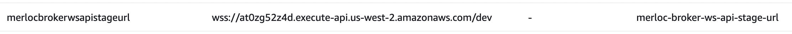

# MerLoc Java


This project provides `GateKeeper` and local `AWS Lambda Runtime` components for Java runtime 
to be able to use [MerLoc](https://github.com/thundra-io/merloc) as live AWS Lambda development tool.

> **Note** that, to be able to use MerLoc for Java runtime, 
first you need to setup MerLoc platform into your AWS account 
as explained at MerLoc Github page [here](https://github.com/thundra-io/merloc).

## 1. Versioning

Artifact versions are in `X.Y.Z` format
- `X`: Major version number.
  - Increases only when there are big API and/or architectural changes.
  - Breaks backward compatibility.
- `Y`: Minor version number.
  - Increases for small API changes and big improvements.
  - Breaks backward compatibility.
- `Z`: Patch version number.
  - Increases for bug fixes and small improvements.
  - Doesn’t break backward compatibility.

## 2. Requirements

* JDK 1.8+ (for build and execution)
* Maven 3.x (for build)

## 3. Build

To build:

```
$ git clone git@github.com:thundra-io/merloc-java.git
$ cd merloc-java/
$ mvn clean install
```

## 4. Setup

### 4.1. GateKeeper Setup

- Add MerLoc GateKeeper layer: `arn:aws:lambda:${region}:269863060030:layer:merloc-java:${version}`

  You can use the latest layer version (shown below) instead of the `${version}` above:
  
   (badge powered by [Globadge serverless](https://www.globadge.com/badges/serverless))

  Note that the region of the ARN is dynamic, so you need to change it accordingly to the region where you deploy your function. 
  So let’s say that you deploy your Lambda function to the `Oregon` (`us-west-2`) region. 
  So the layer ARN will be: `arn:aws:lambda:us-west-2:269863060030:layer:merloc-java:${version}`

- You need to switch the handler so MerLoc GateKeeper will wrap your original handler.
  
  **`Java 8 on Amazon Linux 1`:**
  - Set the handler to `io.thundra.merloc.aws.lambda.gatekeeper.handler.GateKeeperLambdaHandler`
  - And then set the `MERLOC_AWS_LAMBDA_HANDLER` environment variable value to your original handler.
  
  **`Java 8 on Amazon Linux 2` and `Java 11 Corretto`**:
  - Set `AWS_LAMBDA_EXEC_WRAPPER` environment variable to `/opt/merloc_wrapper`

- Set `MERLOC_BROKER_URL` environment variable to the
  - value of the `merloc-broker.merlocbrokerwsapistageurl` property which you get from AWS CDK broker setup output as shown in the example below:
    
  
  - **or** value of the `merlocbrokerwsapistageurl` property which you get from AWS CloudFormation broker setup output as shown in the example below:
    
  
### 4.2. AWS Lambda Runtime Setup

Download MerLoc AWS Lambda embedded runtime from 
`https://repo1.maven.org/maven2/io/thundra/merloc/merloc-aws-lambda-runtime-embedded/${version}/merloc-aws-lambda-runtime-embedded-${version}.jar`

You can use the latest version (shown below) instead of the `${version}` above:


#### 4.2.1. IntelliJ IDEA

- Right click on the project and click `Open Module Settings`.
  

- Click `Global Libraries` and then click `Java` to add a new global library.
  

- Select the MerLoc AWS Lambda runtime jar from the place where you downloaded above. 
  And then chose the modules (single or multiple modules) in which Lambda handlers are located.
  

After these steps are completed, we have added MerLoc AWS Lambda runtime jar into the classpath 
of selected modules in which your AWS Lambda handlers exist.

- Click `Add Configuration` and add a new `Application` configuration.
   

- Select the JDK module (`java 11` in the following example) and classpath module (`hello-api` module in the following example). 
  Then set `Main class` to `io.thundra.merloc.aws.lambda.runtime.embedded.LambdaRuntime`.
  

- Set `MERLOC_BROKER_URL` environment variable (likewise you did for GateKeeper above) to the
  - value of the `merloc-broker.merlocbrokerwsapistageurl` property which you get from AWS CDK broker setup output as shown in the example below:
    

  - **or** value of the `merlocbrokerwsapistageurl` property which you get from AWS CloudFormation broker setup output as shown in the example below:
    
  
  

### 4.2.2. Eclipse

- Open `Run Configurations`.
  

- Right click on `Java Application` and select `New Configuration`.
  

- Select the project (`hello-api` in the following example).
  Then set `Main class` to `io.thundra.merloc.aws.lambda.runtime.embedded.LambdaRuntime` and click `Apply`.
  

- Click `Dependencies` tab, select `Classpath Entries`, click `Add External JARs` and 
  then select the MerLoc AWS Lambda runtime jar from the place where you downloaded above.
  

After these steps are completed, we have added MerLoc AWS Lambda runtime jar into the classpath
of selected project in which your AWS Lambda handler(s) exist.

- Set `MERLOC_BROKER_URL` environment variable (likewise you did for GateKeeper above) to the
  - value of the `merloc-broker.merlocbrokerwsapistageurl` property which you get from AWS CDK broker setup output as shown in the example below:
    

  - **or** value of the `merlocbrokerwsapistageurl` property which you get from AWS CloudFormation broker setup output as shown in the example below:
    

  

## 5. How to Use

### 5.1. IntelliJ IDEA

#### 5.1.1. Run

- Click `Run` to start MerLoc AWS Lambda Runtime.
  

- So you will see MerLoc banner in the console.
  

- Later on, trigger the AWS Lambda function. Then, the real request will be forwarded to MerLoc AWS Lambda Runtime 
  on your local through MerLoc GateKeeper. So it will be executed locally and response will be returned 
  to MerLoc GateKeeper and so to AWS Lambda function caller from there.
  

#### 5.1.2. Debug

- Click `Debug` to start MerLoc AWS Lambda Runtime in debug mode.
  

- So you will see MerLoc banner in the console.
  

- Put breakpoint from your IDE.
  

- Then, trigger the AWS Lambda function. So the forwarded request will stop at the breakpoint you put on your local 
  and you can debug AWS Lambda function locally.
  

#### 5.1.3. Hot-Reload

- While running MerLoc AWS Lambda Runtime on your local, apply your changes in the source code(s). 
  Then go to `Build` in the menu bar and click `Build Module` to re-build module in which you updated source code(s).
  

- After that you will see MerLoc log messages in your console which says that 
  related function environment(s) (affected by changes) have been reloaded.
  

- Then, trigger your AWS Lambda function again, and you will see that 
  your changes are live in the running function on your local.
  

### 5.2. Eclipse

#### 5.2.1. Run

- Open `Run Configurations`. Select the configuration you created before during setup and click `Run`.
  

- So you will see MerLoc banner in the console.
  

- Later on, trigger the AWS Lambda function. Then, the real request will be forwarded to MerLoc AWS Lambda Runtime
  on your local through MerLoc GateKeeper. So it will be executed locally and response will be returned
  to MerLoc GateKeeper and so to AWS Lambda function caller from there.
  

#### 5.2.2. Debug

- Open `Debug Configurations`. Select the configuration you created before during setup and click `Debug`.
  

- So you will see MerLoc banner in the console.
  

- Put breakpoint from your IDE.
  

- Then, trigger the AWS Lambda function. So the forwarded request will stop at the breakpoint you put on your local
  and you can debug AWS Lambda function locally.
  

#### 5.2.3. Hot-Reload

TBD

## 6. Configuration

## 6.1. GateKeeper Configuration

- `MERLOC_BROKER_URL`: This configuration is **MANDATORY**.
  You need to set this environment variable by broker URL 
  as mentioned in the [GateKeeper Setup](#41-gatekeeper-setup) section.

- `MERLOC_ENABLE`: This configuration is **OPTIONAL**. 
  Even though MerLoc GateKeeper layer is added and configured, 
  you can disable it by setting the `MERLOC_ENABLE` environment variable to `false`.
  For example,
  ```
  MERLOC_ENABLE=false
  ```

- `MERLOC_DEBUG_ENABLE`: This configuration is **OPTIONAL**.
  By default, internal debug logs are disabled, 
  but you can enable it by setting the `MERLOC_DEBUG_ENABLE` environment variable to `true`.
  For example,
  ```
  MERLOC_DEBUG_ENABLE=true
  ```

- `MERLOC_BROKER_CONNECTION_NAME`: This configuration is **OPTIONAL**.
  By default, the name of the connection to the broker is the name of the AWS Lambda function for GateKeeper.
  But you can change it by setting the `MERLOC_BROKER_CONNECTION_NAME` environment variable.
  For example,
  ```
  MERLOC_BROKER_CONNECTION_NAME=serkan-connection
  ```
  
- `MERLOC_CLIENT_ACCESS_INTERVAL_ON_FAILURE`: This configuration is **OPTIONAL**.
  By default, MerLoc GateKeeper tries to access to the client (your local AWS Lambda runtime) at every request 
  even though the local runtime/function is not up/running or unreachable at the previous attempt. 
  If it fails (local runtime is not up, rejected because of concurrency mode, etc ...), 
  it bypasses MerLoc flow and forwards the request to your original handler for allowing the function to be executed as is. 
  But such checks at every request introduce some additional little delays (up to 1 sec) 
  if your function is configured to use MerLoc (and it is not disabled) and your local is not up.
  To get rid of such additional minor delay (when you are not running MerLoc on your local, and you didn't disable it),
  you can configure `MERLOC_CLIENT_ACCESS_INTERVAL_ON_FAILURE` environment variable 
  to specify the client (your local AWS Lambda runtime) access check interval in seconds instead of at every request.
  So if a client (your local AWS Lambda runtime) access check fails, 
  MerLoc GateKeeper will not check until the configured seconds have passed since the last failed check.
  For example (check every 5 minutes instead of at every request in case of failure),
  ```
  MERLOC_CLIENT_ACCESS_INTERVAL_ON_FAILURE=300
  ```

## 6.2. AWS Lambda Runtime Configuration

- `MERLOC_BROKER_URL`: This configuration is **MANDATORY**.
  You need to set this environment variable by broker URL
  as mentioned in the [AWS Lambda Runtime Setup](#42-aws-lambda-runtime-setup) section.

- `MERLOC_AWS_LAMBDA_RUNTIME_CONCURRENCY_MODE`: This configuration is **OPTIONAL**.
  Configures concurrency level at runtime level globally.
  Valid values are:
  - `REJECT`: Rejects any invocation from any function if local runtime is busy executing other invocation. 
              In this case, GateKeeper is informed by local runtime with the rejection 
              and then GateKeeper forwards the request to the original user handler.
  - `WAIT`: Waits any invocation from any function until runtime is available 
            if local runtime is busy executing another invocation.
  - `PER_FUNCTION`: Disables global lock between functions and runtime lock is handled at per function basis 
                    according to `MERLOC_AWS_LAMBDA_RUNTIME_FUNCTION_CONCURRENCY_MODE` configuration mentioned below.
  The default value is `REJECT`.
  For example,
  ```
  MERLOC_AWS_LAMBDA_RUNTIME_CONCURRENCY_MODE=PER_FUNCTION
  ```

- `MERLOC_AWS_LAMBDA_RUNTIME_FUNCTION_CONCURRENCY_MODE`: This configuration is **OPTIONAL**.
  Configures concurrency level at function level so executing a function doesn't block executing another function.
  Valid values are:
  - `REJECT`: Rejects an invocation from a function if local runtime is busy executing other invocation of that function.
              In this case, GateKeeper is informed by local runtime with the rejection
              and then GateKeeper forwards the request to the original user handler.
  - `WAIT`: Waits an invocation from a function until runtime is available
            if local runtime is busy executing another invocation of that function.
  The default value is `REJECT`.
  For example,
  ```
  MERLOC_AWS_LAMBDA_RUNTIME_FUNCTION_CONCURRENCY_MODE=WAIT
  ```
  
- `MERLOC_DEBUG_ENABLE`: This configuration is **OPTIONAL**.
  By default, internal debug logs are disabled,
  but you can enable it by setting the `MERLOC_DEBUG_ENABLE` environment variable to `true`.
  For example,
  ```
  MERLOC_DEBUG_ENABLE=true
  ```

- `MERLOC_BROKER_CONNECTION_NAME`: This configuration is **OPTIONAL**.
  By default, the name of the connection to the broker is `default` for local AWS Lambda runtime.
  Local AWS Lambda runtime connection with name `default` matches with all GateKeeper connections 
  if there is no another local AWS Lambda runtime connection with the function name 
  (or connection name set by `MERLOC_BROKER_CONNECTION_NAME` at GateKeeper) specifically.
  But you can change it by setting the `MERLOC_BROKER_CONNECTION_NAME` environment variable.
  For example,
  ```
  MERLOC_BROKER_CONNECTION_NAME=serkan-connection
  ```

## 7. Limitations

- If the resources (AWS RDS, AWS OpenSearch/Elasticsearch, AWS ElastiCache, etc ...) you are accessing inside the function are deployed inside a VPC,
  your local needs to have access to resources in the VPC.
  So you need to setup a VPN connection from your local machine to the VPC network.
  You can check [this AWS blog post](https://aws.amazon.com/tr/blogs/networking-and-content-delivery/introducing-aws-client-vpn-to-securely-access-aws-and-on-premises-resources/)
  to learn how to do that.

- Currently, AWS Lambda layers are not supported. So if you use layers, they will not be available on your local 
  while running function locally as MerLoc doesn't download and extract layers onto your local environment.

## 8. Issues and Feedback

[](https://github.com/thundra-io/merloc-java/issues?q=is%3Aopen+is%3Aissue)
[](https://github.com/thundra-io/merloc-java/issues?q=is%3Aissue+is%3Aclosed)

Please use [GitHub Issues](https://github.com/thundra-io/merloc-java/issues) for any bug report, feature request and support.

## 9. Contribution

[](https://github.com/thundra-io/merloc-java/pulls?q=is%3Aopen+is%3Apr)
[](https://github.com/thundra-io/merloc-java/pulls?q=is%3Apr+is%3Aclosed)
[]()

If you would like to contribute, please
- Fork the repository on GitHub and clone your fork.
- Create a branch for your changes and make your changes on it.
- Send a pull request by explaining clearly what is your contribution.

> Tip: Please check the existing pull requests for similar contributions and consider submit an issue to discuss the proposed feature before writing code.

## 10. License

Licensed under [Apache License 2.0](LICENSE).
